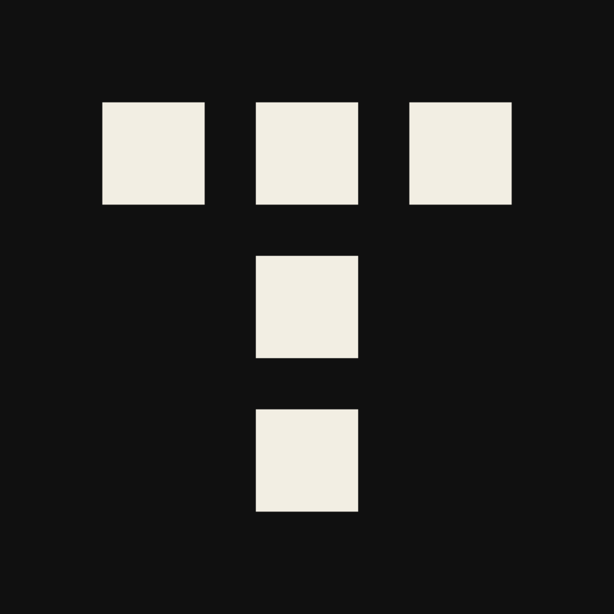

# Tessera

**Turn uneven pixels into usable pixel art.**

Tessera is a standalone Windows app for preparing pixel art and icons. It began with a specific problem: AI-generated pixel art often looks pixelated, but its grid is uneven and its “pixels” have different sizes. Tessera helps align those shapes to a consistent grid so you can keep working with the image.

The name comes from a *tessera*, an individual piece of a mosaic.

Today, Tessera brings the rest of that workflow together:

- Align a pixel grid and reduce each cell to a single pixel.
- Downscale images, reduce colors and choose a palette.
- Keep source images and a history of results in a local library.
- Compare previews with crisp zoom, synchronized scrolling and transparency backgrounds.
- Create Windows ICO files containing several icon sizes.
- Remove a solid background color locally, with adjustable tolerance.
- Preserve transparency and export the result.

Everything runs locally, without an internet connection. Download, unpack and launch.

[**Download Tessera for Windows x64**](https://github.com/Timbuhtuk/PIXELIZATOR/releases/latest)
